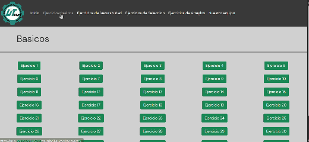

<div align="center">
  <br>
  
  <h1>⚙️ JavaScript Portfolio ⚙️</h1>
  <strong>A project made with my school mates about <a href="https://lucia-aranda.github.io/javascript/">javascript operations</a> with algorithms.</strong>
</div>

## Summary

| #   | Section                                                                                                                              |
| --- | -------------------------------------------------------------------------------------------------------------------------------------|
| ⭐   | [Menu](https://lucia-aranda.github.io/javascript/): Welcoming and overview.                                                        |
| 📗   | [Basic](https://lucia-aranda.github.io/javascript/basicos/basicos.html): Basic excercises.                                         |
| 💫   | [Recursivity](https://lucia-aranda.github.io/javascript/recursividad/recursividad.html): Recursive excercises.                     |
| 🗂️   | [Selection](https://lucia-aranda.github.io/javascript/seleccion/seleccion.html): Seleciton excercises.                             |
| 📚   | [Arrays](https://lucia-aranda.github.io/javascript/arreglos/arreglos.html): Array excercises.                                      |
| 📋   | [Credits](https://lucia-aranda.github.io/javascript/nosotros.html): Subject and team members.                                      |

## Prerequisites

To run the project locally, you need a code environment installed on your machine:

- `Visual Studio Code (or any other similar software)`

This optional extension (omit if you already have a virtual server):

```
Live Server by Ritwick Dey
```

And internet conection 🌐 to some features work propertly.

## Concept

This is a responsive javascript portfolio using mathematical exercises with recursivity, arrays, selection, including while, do while, and for loops. Showcases fundamental programming logic and control flow structures with practical, executable examples. 🧮

It combines JavaScript animations, CSS styling, Bootstrap and modern front-end techniques to create an engaging user experience. The project features interactive hover effects, and minimalist design that enhance visual simplicity. With clean code structure, the project demonstrates both technical skills like JavaScript DOM manipulation, alongside strong design sensibility through responsive layouts and user-friendly navigation. 👩‍💻

Whether you're a developer interested in seeing clean implementations of fundamental programming patterns, or someone curious about how code can tackle mathematical puzzles, this portfolio offers hands-on examples that are both educational and engaging. Each exercise is designed to make complex computational logic accessible and visual. 📔

## Installation

This is a PWA, wich means you can install it from the browser to your own mobile phone 📱 or desk 💻, searching the installation button on the browser's menu.

<br>

## Contributing

Even though this project isn't open to contributors, feel free to DM me 💬 if you have any question(s)/need help/concern(s) about :)

## Quick visualization


